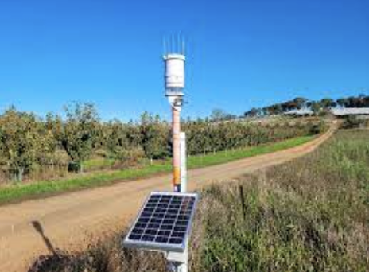

- [Web Page Layouts](https://www.youtube.com/watch?v=3C_22eBWpjg)
- [JS Native Fetch](https://www.youtube.com/watch?v=MBqS1kYzwTc)

# Project Purpose

A temperature and humidity sensor connected to an ESP32 accessible to a worldwide community shows the core concept of the Internet of Things (IoT). The IoT stands for the Internet of Things, a term used to describe a network of interconnected devices that communicate and exchange data through the Internet, without the help of human intervention. The purpose of this setup is in its ability to enhance automation, data collection, and further build on remote sensing and monitoring in multiple fields. The Weather Sensor can serve many purposes. On a small scale, it can act as a way for homeowners to check the humidity and temperature around plants or other vegetation, allowing them to remotely monitor this and get others to act upon it. Yet this Device ranges from home Automation to large-scale projects, such as weather stations, which, using projects such as these, can aid meteorological research and gather crowd-sourced data, providing real-time updates globally.

The integration of devices such as these allows for a variety of benefits, which vary in both usefulness and scale. The creation of my product allows for enhancements in efficiency and remote access, yet above all, is another step in contributing to the IoT and creating Smart Cities: Sensors in urban environments monitor pollution levels, traffic flow, and public infrastructure, aiding city planning and management.

## Description of all the parts

### DHT11 Humidity Sensor

The DHT11 humidity sensor is a module for the ESP32, which is able to identify the temperature and humidity from a range of 0-50 degrees Celsius and 20% to 80% humidity. It integrates a thermistor and a capacitive humidity sensor. An integrated ADC converter converts the measured values into a digital signal, which is then output via the OneWire interface.

#### DHT11 Pin Configuration
- Pin 1: Vcc
- Pin 2: Data
- Pin 3: NC
- Pin 4: GND

### 430 Pin Breadboard

The 430-pin breadboard serves as the basis for any ESP32 project, providing a way to build temporary circuits. The breadboard used in my project is a 430-pin breadboard, meaning there is space for 430 different pins.

### Male-to-Male Breadboard Connectors

Male-to-male breadboard connectors are wires that can transmit a signal over a short distance. These wires are ideal for creating circuits from the ESP32 to the breadboard. They typically come in varying colors so you can distinguish them when making a project.

### ESP32 WROOM

The ESP32 WROOM dev board is the board I am using for my project. It is a powerful and versatile Wi-Fi and Bluetooth module developed by Espressif Systems. The ESP32-WROOM integrates a dual-core processor, Wi-Fi, Bluetooth, and several hardware peripherals, making it ideal for a wide range of IoT projects.

### Firmware

The Weather Module is run through the Arduino IDE and compiled in Visual Studio Code. The Arduino Integrated Development Environment (IDE) is a software platform for programming Arduino microcontroller boards. It provides an interface for compiling code, writing code, and uploading it, both through Arduino and other external sources.

### Libraries such as Arest and DHT.h

Arduino libraries are a set of pre-written code modules that affect and simplify programming tasks and functions for microcontroller boards. The aRest Library is used for creating 'Restful APIs. It simplifies the process of creating APIs, enabling the board to respond to HTTP requests and exchange data with other devices or other servers. This library is useful for enabling IoT devices to interact with cloud platforms, web applications, and mobile apps. The DHT.h library is used for my project, which is a library specifically designed for DHT series sensors, such as the DHT11 and DHT22, which measure temperature and humidity. The library provides functions to read data from these sensors accurately. It handles the communication protocols and data parsing, making it simple for Arduino users to integrate DHT sensors into their projects.

## How to Run and Install Arduino for MacBook Air

1. Install Arduino IDE from [arduino.cc](https://www.arduino.cc).
2. In Arduino IDE, go to Preferences -> Additional Boards Manager URLs and paste the link.
3. In Arduino IDE, go to Boards Manager, search for "ESP," select "ESP32 by Espressif," and install.
4. In Arduino IDE, go to Tools -> Board -> ESP32 -> ESP32 Dev Module.
5. In Arduino IDE, go to Tools -> Port and select the appropriate port.
6. Set Upload Speed to 115200.
7. Plug in a USB data cable and attach it to the motherboard.

## How to Install Visual Studio Code

1. Download the latest version of Visual Studio Code from [here](https://code.visualstudio.com).
2. Open the downloaded file in Finder and press "Launch."

## Timeline

**Date 29/8/23 Goal Setting: Aim To Complete 1/09/23**

- Sent an email for the sensor to Mr. Lemmer.
- Chosen Sensors: Laser Module and Temperature and Humidity sensor.
- Completed Node.js courses on Edstem to develop a basic understanding of Node.js.

**Date 1/09/23 Goal Setting: Aim To Complete 3/09/23**

- Completed Node.js courses.
- Email to Mr. Lemmer sent.
- Work to complete: Decide on module, research, and have a framework in place.

**Date 3/09/23 Goal Setting: Aim To Complete 9/09/23**

- Researched sources.
- DHT11 sensor overview.
- Breakdown of DHT11 Components.
- Scrapped Laser Sensor Research.
- Work to complete: Create Github Repo and fork Mr. Zampogna’s files into the repo. Begin Readme.

**Date 9/09/23 Goal Setting: Aim To Complete 15/09/23**

- IoT Weather Github Repo Made.
- Readme Created (No evidence Available).
- Work to complete: Code and build ESP32 to run on a computer. Troubleshoot bugs.

**Date 15/09/23 Goal Setting: Aim To Complete 20/09/23**

- Error#1 ‘An Error Occurred While Fetching Data’ (occurs when hosting the server, after running Visual Studio code.)
  Solution: Find your unique Device number and put it in the following fields, then run the code again.
- Error#2 ‘UND_ERR_CONNECT_TIMEOUT’ (occurs when running File Ws.DHT11.ino)
  Solution: The WiFi may have changed, and therefore the constant ssid and password need to be changed. Change the following fields to your WiFi password and ssid. (Do not make this available/visible on a public repo for obvious reasons).
- Work to Complete: Completely finish the project, with CSS and HTML to create an engaging weather app, which serves its purpose. Complete Final Test.

**Date 15/09/23 Goal Setting: Aim To Complete 10/10/23**

- When running the final tests for my DHT11 Temperature and Humidity sensor, The Sensor Melted, due to the voltage being too high. This has led me to be unable to fully showcase my project. I predict the source of this was due to the fact that I didn’t have a resistor, which would have limited the current going through the circuits. The images provided are evidence of this.
- Due to this, I had no way of being able to showcase the CSS and EJS. The code Is available within this Github Repo. Throughout.

## Final Statements/Personal Reflection

Throughout this project, I have expanded my knowledge of the IoT and GitHub repos, and developed my skills in EJS, CSS, and Node.js. My Project aimed to create a Temperature and Humidity Sensor, able to access anywhere in the world, by anyone, showing the effectiveness and efficiency of the IoT. Through this project, I managed to stick to my deadlines, create frameworks, and fix and debug problems. Though the module melted, rendering me unable to complete and test my website, there will be many more opportunities to try again, hopefully with a little more success.

## References

- [Reference 1](https://cgsacteduau.sharepoint.com/:w:/s/cgssharedfolders/EYFme3O0UvhGjYmxXSuQPxYB7mwCwkD_q7WfD8JGlIj4sg?e=FgPANr)
- [Reference 2](https://cgsacteduau.sharepoint.com/:w:/s/cgssharedfolders/Edo6Z-KSFRRJodRrg2kWNPgBx7zYcW60qTzR-3iL4ZldqQ?e=8QLm4T)
- [Reference 3](https://www.elecrow.com/blog/how-to-use-a-breadboard-for-beginners.html)
- [Reference 4](https://www.freecodecamp.org/news/how-to-write-a-good-readme-file/)
- [Reference 5](https://www.proprofsproject.com/blog/project-management-quotes/)

